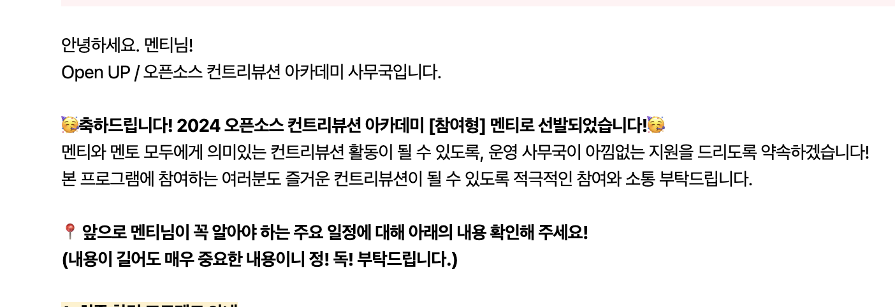
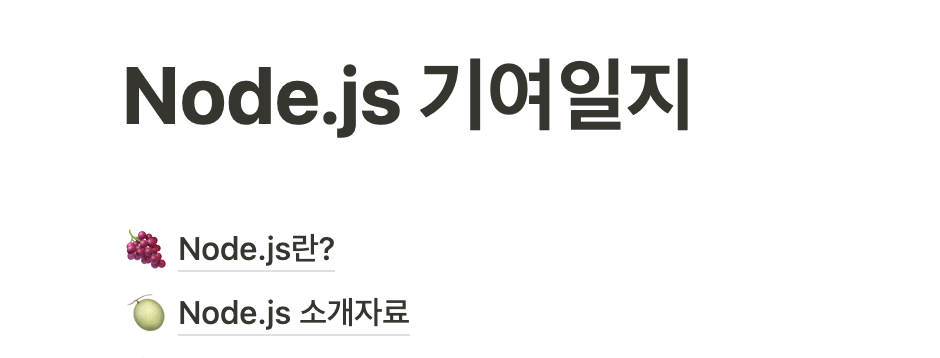
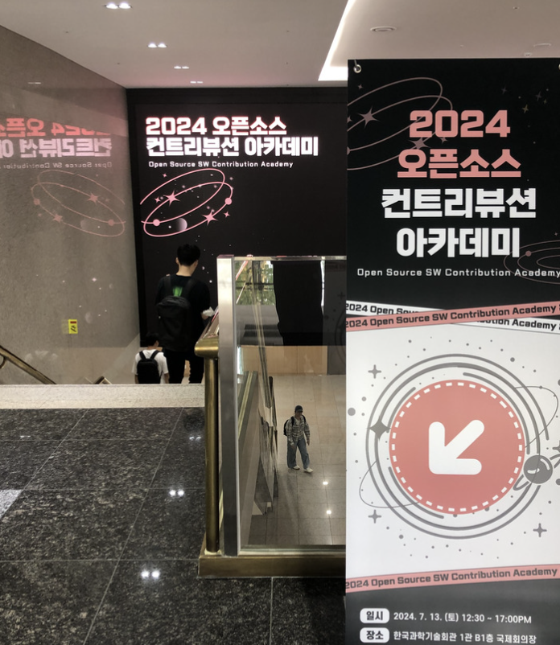
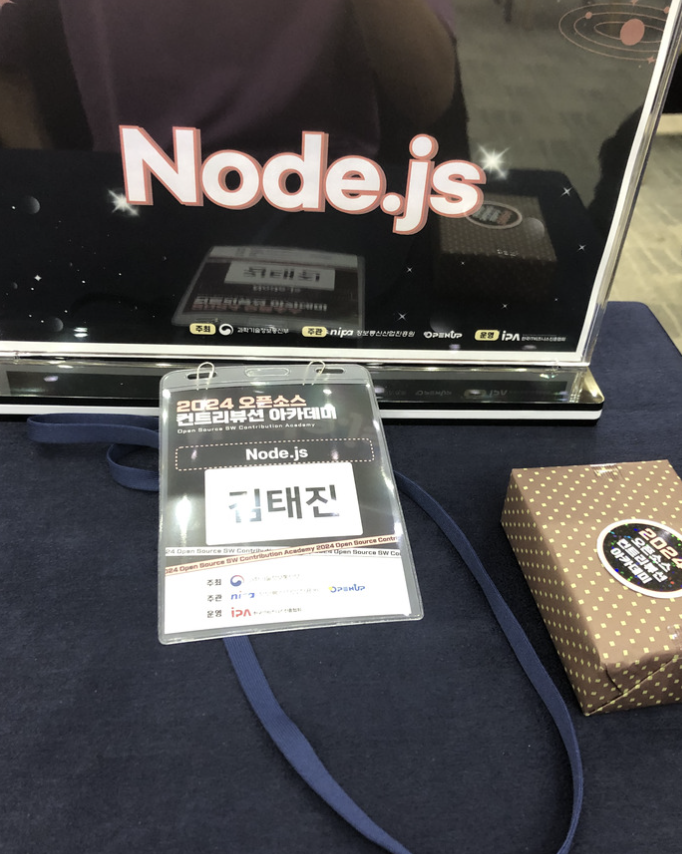

## 개발인생 첫 뜻깊은 대외활동

오픈소스 컨트리뷰션 아카데미라는 대외활동이 있다는 것은 알고 있었지만 나는 이미 오픈소스 기여경험이 있었고 이 활동을 주변에 한 사람들이 없어서 따로 선발일정이나 기타 정보를 찾아보지 않았었다. 하지만 우연히 코딩을 하면서 구글링을 하다가 본 대외활동에서 멘티를 모집중이라는 것을 알게 되었다.

어떤 오픈소스 프로젝트들이 있나 보니까 바로 **Node.js**가 있었다. 프론트 개발을 하며 **Node.js**는 정말 빼 놓을 수 없는 중요한 존재이기 때문에 이 프로젝트에 기여하면 내 개발 커리어에 큰 영향을 줄 수 있겠다는 것을 확신했다. 내가 멘티를 모집한다는 것을 알게된 날이 모집을 마감하는 날이었다. 빨리 자소서를 쓰고 내야 겠다는 생각에 조급했지만 내가 이 프로젝트를 잘 참여할 수 있는 근거를 적고 아직 경험없는 대학생이기 때문에 열정을 많이 어필하였다.

## 기대하던 합격 메일을 받다!

7월 8일에 내 메일로 합격 메일이 왔다.

이후 디스코드 채널에 참여하고 팀별 채팅룸에 들어갔다.

## 발대식 전 나름의 Node.js 공부!

발대식 전에 나름의 Node.js 공부를 혼자 하였다. 멘토님이 처음에 적어주신 프로젝트 소개 문서와 여러 블로그를 참고하며 Node.js의 구조와 동작방식을 위주로 공부하였다.

정말 미루기의 끝판왕이며 기록을 싫어하는 내가 노션에 상세하게 적어 놓았다. 그만큼 이번 활동을 통해 이루게될 성장이 너무 기대되었고 허투로 보내고 싶지 않았다.

## 발대식 참여

발대식은 강남에 위치한 한국과학기술회간에서 B1에서 진행하였다. 도착하여 키트와 명찰을 수령하고 간식을 챙겨서 자리에 앉았다.

이런 행사에 참여해보는게 처음이다보니 긴장도 되고 설레기도 했다. 이 순간을 간직하고 싶어서 사진도 찍어 보았다.

## 발대식 시작!

발대식에서는 우리 멘티들이 앞으로 어떤 활동을 어떻게 해나갈지 설명해주는 시간을 가졌다. 그리고 특강을 들었는데 앞으로 활동을 하는데에 있어서 충분한 동기부여가 되었다.

## 발대식 이후 팀별 밍글링

이후 **Node.js**의 Collaborator이신 멘토님과 다른 팀원분들과 서로 소개하는 시간과 질의응답을 하는 시간을 가지게 되었다.
기억에 남는 말씀으로는 **Node.js** 프로젝트는 문서화가 정말 잘 되어있다고 하신 부분이다. 이 말씀은 지금 현재 **Node.js** 레포지터리를 보며 정말 실감하고 있다 가이드 문서나 빌드 관련 문서들이 정리가 잘 되어있는 것을 확인할 수 있었다. 오픈소스의 표준에 대해 잘 이해하게 될 수 있을 것이다. 그리고 **Node.js**같은 유명한 오픈소스를 기여하게 되면 그만큼 일자리를 잡는데 유리한 포지션에 있을 수 있다고 말씀하셨다.

그리고 기억에 남는 질의응답으로는 아래와 같다.

> 본 프로젝트의 코어에도 기여를 할 수 있겠지만 자바스크립트 레이어에서도 기여할 부분이 많다. 그리고 많은 사람이 함께 만들어나가는 프로젝트인만큼 리팩토링이 필요한 부분이 많고 리팩토링을 지속적으로 해나가는 것이 중요하다.

## 느낀점

같은 멘티 분들 중에 현직자 분들이 많았고 스펙이 좋으신 분들이 많았다. 상대적으로 초라해졌지만 오히려 그렇기 때문에 이 활동을 통해 많이 성장을 할 수 있을 것이다. **Node.js**의 컨트리뷰터라는 타이틀을 달고 유리한 포지션에서 회사를 지원하고 싶다!! 앞으로 열심히 활동하자!
